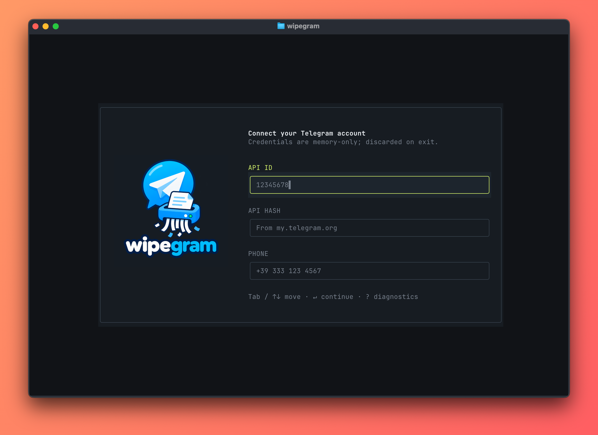
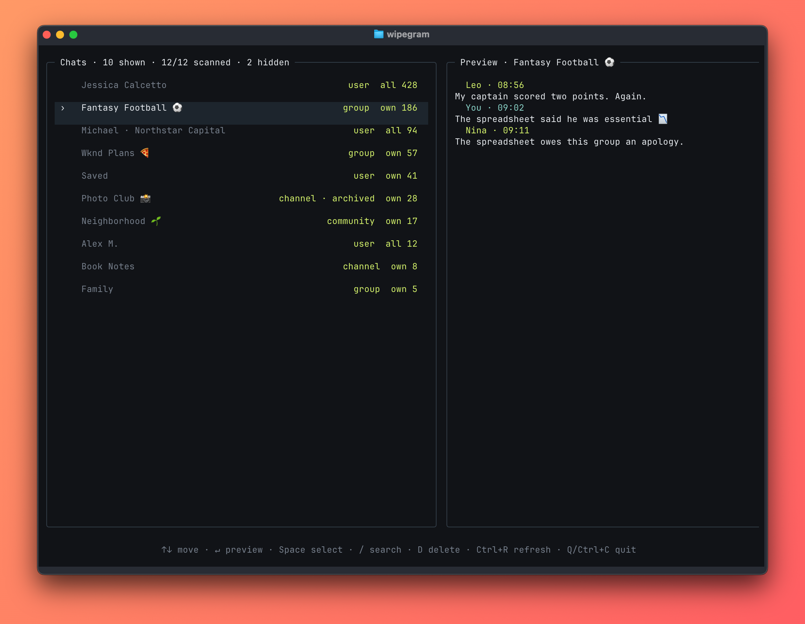

<p align="center">
  
</p>

<p align="center">
  <strong>Wipe private chats. Remove your group messages. Leave no session file behind.</strong>
</p>

<p align="center">
  A fast terminal interface with process-only authentication and no persistent Telegram session.
</p>

wipegram authenticates as you, lists your Telegram dialogs, previews recent context, and lets you
select chats for cleanup. **In private one-to-one chats it wipes the complete conversation for both
participants, including received messages. In groups, channels, and communities it deletes only
messages you sent.** Destructive actions always require a separate confirmation step.

## Preview

<p align="center">
  
</p>
<p align="center"><em>Process-only authentication keeps credentials and session data in memory.</em></p>

<p align="center">
  
</p>
<p align="center"><em>Exact cleanup scopes, multi-chat navigation, and recent context. All names, chats, message counts, and conversations shown are fictional.</em></p>

## Features

- Polished, keyboard-driven [OpenTUI](https://opentui.com/) interface
- Responsive onboarding with native-image branding across supported terminal sizes
- Exact Telegram-side cleanup counts that exclude service events
- In-memory message previews with 15-message, on-demand history pages
- Local chat search and explicit multi-chat selection
- Full private-chat revocation and batched own-message deletion in groups
- Sanitized diagnostics held only in memory for live troubleshooting
- Fully ephemeral authentication powered by [mtcute](https://mtcute.dev/), with no session files

## Ephemeral by design

**wipegram never intentionally persists credentials or Telegram session data to disk.
Authentication state exists only for the lifetime of the process. During a graceful exit, wipegram
makes a bounded request for Telegram to revoke the ephemeral session.**

mtcute runs with `MemoryStorage`; wipegram does not export sessions, write log files, or enable
verbose MTProto logging. API credentials, phone numbers, login codes, passwords, auth keys, peer
identifiers, and message content are excluded from the in-app diagnostic buffer.

JavaScript cannot promise cryptographic zeroization of immutable strings or physical RAM. wipegram's
guarantee is non-persistence, not physical-memory erasure.

## Get Telegram credentials

wipegram needs Telegram's standard user-client credentials and verifies your account during each
launch. Nothing needs to be added to a configuration or `.env` file.

1. Sign in at [my.telegram.org](https://my.telegram.org/) with your Telegram phone number.
2. Open **API development tools** and create an application if you do not already have one. The app
   title and short name are labels for your own Telegram developer application.
3. Copy the displayed **App api_id** and **App api_hash** into wipegram. Treat the `api_hash` as a
   secret; Telegram does not provide a way to revoke it.
4. Enter the phone number of the Telegram account you want to clean, including its country code.
5. Enter the login code Telegram sends, usually inside the Telegram app. If the account has
   two-step verification enabled, wipegram will also request that existing Telegram password.

The `api_hash`, login code, and two-step verification password are different values. wipegram masks
the API hash and two-step verification password and never accepts secrets as command-line arguments.

## Requirements

- [Bun](https://bun.sh/) 1.3 or newer
- A Telegram `api_id` and `api_hash` from [my.telegram.org/apps](https://my.telegram.org/apps)
- A terminal at least 60 columns wide and 18 rows tall

## Run

```bash
bun install
bun start
```

Enter credentials in the OpenTUI. Do not pass secrets as command-line arguments. Each launch creates
a new in-memory Telegram session, so Telegram authentication is required again after exit. Shutdown
remains bounded if Telegram is unreachable. A crash, forced termination, or failed logout request can
leave the authorization visible in Telegram's active sessions.

wipegram adapts to the terminal's current dimensions and never resizes the terminal window. Resize
normally at any time; compact layouts scale the branding to preserve the workflow.

## Controls

| Key | Action |
| --- | --- |
| `↑` / `↓`, `k` / `j` | Navigate chats |
| `Space` | Toggle chat selection |
| `↵ Enter` | Focus the highlighted chat preview or confirm a dialog |
| `↑` / `↓` in preview | Browse context; load 15 older messages at the top |
| `/` | Search titles and usernames |
| `D` | Review the deletion scope for selected chats |
| `Ctrl+R` | Restart the exact dialog scan |
| `Esc` | Cancel or go back |
| `?` | View sanitized in-memory diagnostics |
| `Ctrl+C` or `Q` | Quit; `Q` remains text in inputs, and deletion stops after the active request |

## Safety

Deletion is destructive. **For private one-to-one chats, wipegram requests deletion of the entire
conversation for both participants, including messages the other person sent. For groups, channels,
and communities, wipegram requests deletion only of messages you sent.** Telegram ultimately decides
what can be revoked. Failed batches or history requests are reported rather than counted as
successful. Private-chat counts are pre-deletion estimates. Cancelling stops new requests after any
request already in flight finishes. If a multi-request private cleanup is interrupted, wipegram
reports its estimated scope as unconfirmed because Telegram does not return a per-request count.
Telegram-managed service events are excluded from group counts and deletion because they are not
reliably revocable; a group containing only those events is considered clean.

## Tech

[Bun](https://bun.sh/) · [TypeScript](https://www.typescriptlang.org/) ·
[mtcute](https://mtcute.dev/) · [OpenTUI](https://opentui.com/)
